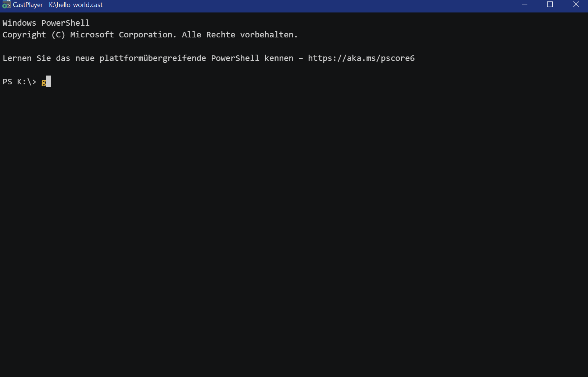

# CastPlayer

This application wraps the (wonderful) **asciinema** player into a small Electron app which allows the user to 
playback casts without using the command line and without connecting to the internet or even sharing the cast 
to the internet first.

This is handy in presentations where there might not be an internet connection and screwing around with the 
terminal confuses the audience or is a hassle in other ways.

The application is shared in the hope that it might be useful to somebody and keeps the Apache 2.0 license of 
the original player. If you like and use it, please be sure to also check out the player repository at 
https://github.com/asciinema/asciinema-player

## Prepare the build environment
Before starting to build, make sure you have NodeJS installed. You may obtain it from https://nodejs.org/ -
I recommend using the LTS version. Once you have installed NodeJS, you must run the following command:

    npm install

This will fetch the dependencies from the internet. Once done, you can build the application.

## How to build
You may build the app using these commands:

    # build only
    npm run build

    # build only for individual platforms
    npm run build:win
    npm run build:linux

    # build and package
    npm run pack

    # build and package for individual platforms
    npm run pack:win
    npm run pack:linux

### MSI setup
The Windows build also comes with an MSI installer which can be built if the WIX Toolkit is installed. You may
obtain the WIX Toolkit from https://wixtoolset.org/ - please make sure you add the `bin` directory within the
installation directory to `PATH`. In most cases, this will be `C:\Program Files (x86)\WiX Toolset v3.11\bin`.

